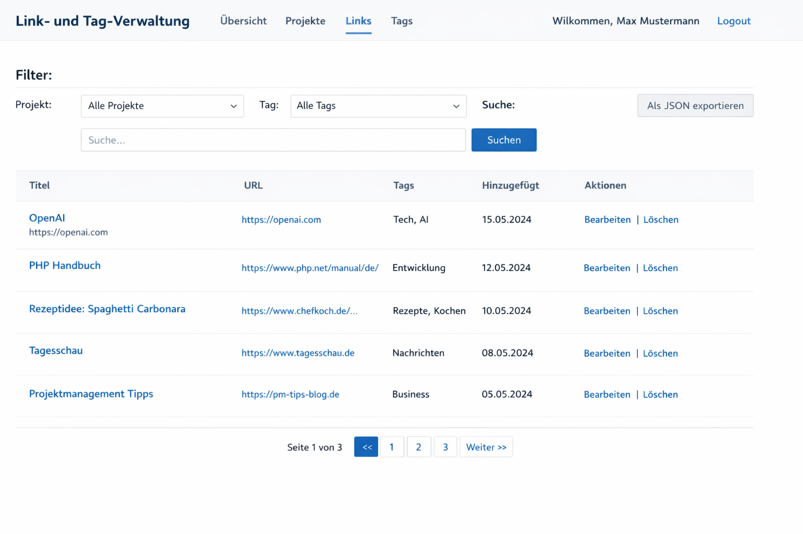

# SASD Links – PHP MVC (Wunderlist-Style)

Link Ledger PHP MVC Client:

- Links: Projekte
- Mitte: Links/URLs + Suche + Tag-Filter
- Rechts: Details + Tags (Dropdown) + Tag-Verwaltung
- Export: JSON Snapshot / CSV (Excel)

## Setup
1) MySQL DB anlegen (z.B. `sasd_links`) und config/config.php anpassen.
2) Hosting:
   - Empfohlen: DocumentRoot -> `public/`
   - Unterstützt: DocumentRoot -> Projekt-Root (Root index.php + .htaccess)

## URLs
- /login, /register
- /app
- /export/json, /export/csv

## Hinweis
Tabellen werden beim Start automatisch angelegt (Auto-Schema).

# LinkLedger – Datenbankschema (IONOS / MySQL)
Dieses Verzeichnis enthält das SQL-Schema für LinkLedger/SASD Links.

## Inhalt

- `linkledger_schema_ionos.sql`
  - erstellt Tabellen für: `users`, `projects`, `tags`, `links`, `link_tags`
  - verwendet `InnoDB` (Foreign Keys + ON DELETE CASCADE)
  - verwendet `utf8mb4` (Umlaute/Emoji)
  - erkennt Duplikate von Links pro **User + Projekt** über:
    - `canonical_url` → SHA-256 → `canonical_hash CHAR(64)`
    - Unique Index: `uq_links_dup (user_id, project_id, canonical_hash)`

## Ausführen in IONOS (phpMyAdmin)

1. **In IONOS einloggen**
   - Webhosting → Datenbanken → phpMyAdmin öffnen

2. **Datenbank auswählen**
   - Links die richtige DB anklicken (z. B. `linkledger`)

3. **SQL importieren**
   - Tab **„SQL“** öffnen
   - Inhalt aus `linkledger_schema_ionos.sql` einfügen
   - **„OK / Ausführen“** klicken

Alternative (Import-Tab):
- Tab **„Importieren“**
- Datei `linkledger_schema_ionos.sql` auswählen
- Zeichenkodierung: `utf-8`
- Ausführen

## Typische Probleme & Lösungen

### 1) Foreign Keys werden nicht angelegt
- Ursache: Tabelle ist nicht `InnoDB` oder DB hat falsche Engine-Defaults.
- Lösung: Script nutzt `ENGINE=InnoDB`. Stelle sicher, dass deine DB das unterstützt.

### 2) „Cannot add foreign key constraint“
- Häufige Ursachen:
  - Tabellenreihenfolge (im Script korrekt: users → projects/tags → links → link_tags)
  - Unterschiedliche Collation/Charset (im Script überall utf8mb4)
- Lösung:
  - Script vollständig ausführen (nicht nur Teile).
  - Keine Tabellen mit gleichen Namen aber anderer Collation vorher angelegt lassen.

### 3) Fehler wegen bereits vorhandener Tabellen
- Script nutzt `CREATE TABLE IF NOT EXISTS`, also normalerweise unkritisch.
- Wenn du „frisch“ neu aufsetzen willst:
  - im SQL-File die Drop-Sektion entkommentieren (Achtung: Datenverlust)

## Empfehlung für Deployment

- Lege `docs/sql/` in deinem Repo ab (dieses Verzeichnis).
- Hinterlege DB-Zugangsdaten **nicht** im Repo, sondern in einer lokalen `config.php`,
  die nicht eingecheckt wird (z. B. `.gitignore`).

## Prüfen ob alles da ist

Nach dem Import sollten diese Tabellen existieren:

- `users`
- `projects`
- `tags`
- `links`
- `link_tags`

In phpMyAdmin kannst du rechts in der Tabellenliste kontrollieren, ob alle vorhanden sind.

